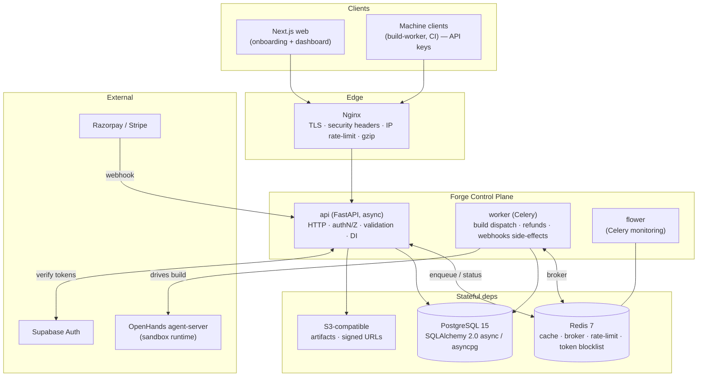
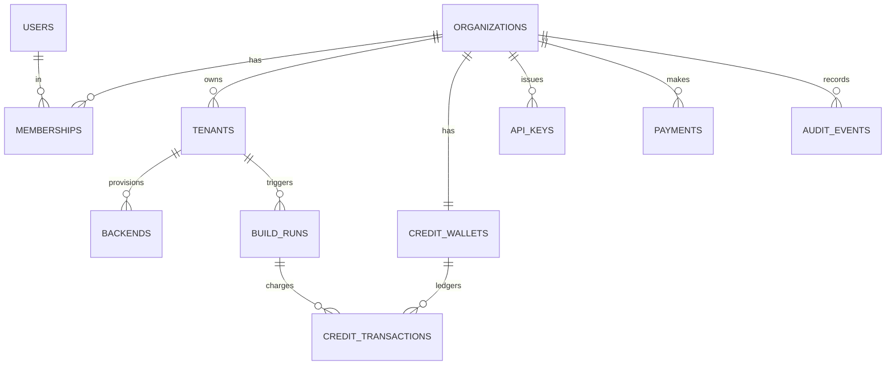

# Phase 0 — Architecture Plan: Platform Control Plane (codename **Forge**)

**Service:** `forge` — the Orchestrator / Control Plane
**Author:** Ashish Yadav, Trinetra Labs · **Date:** 15 June 2026 · **Status:** Plan (sign-off gate before further phases)

> This is the control-plane brain of the multi-industry app platform (see `../../System-Design-Multi-Industry-App-Platform.md` and `../../Implementation-Plan-Phases.md`). It does **not** run agent builds itself — it *orchestrates* them. It owns tenants, identity, credits, build-job dispatch, and billing.

> **⚠️ Canonical decisions: `../../PROJECT-HANDOFF.md` (repo root).** Reminder of the boundary this control plane enforces: the BluHands agent (built from `openhands-sdk` + `openhands-tools` + `openhands-agent-server` + our custom tools/skills — **not a fork**) **consumes** industry backends and builds **only the frontend**; backend capability is productized into a per-industry catalog with human review. Phases 0–2 are complete; Phase 3 is build orchestration.

---

## 1. Project brief (placeholders filled)

- **App name:** Forge (Platform Control Plane).
- **One-line:** A secure, multi-tenant control plane that onboards merchants, provisions per-industry backends, dispatches sandboxed OpenHands build jobs, and meters credits/billing for an AI app-building platform.
- **Primary users:** SMB owners (*merchants* — non-technical, e.g. a thrift-store owner) and *platform staff* (admins). Machine clients (build-workers, CI) via API keys.
- **Core features:**
  1. **Tenant onboarding & lifecycle** — org/user/tenant creation, industry selection, backend provisioning requests, state machine.
  2. **Build-job orchestration** — enqueue/track sandboxed OpenHands builds via Celery; status polling/streaming; preview→prod approval.
  3. **Credit & billing system** — atomic credit deduction/refund per build, payment-webhook–confirmed top-ups, admin API keys.
- **Expected scale:** launch ~500 concurrent; target peak ~10,000 concurrent; build jobs are async (queue-absorbed), so the API stays light. Data volume: control-plane rows + build metadata/logs references (artifacts live in object storage, not the DB).
- **Key integrations:** Supabase Auth (platform identity, prod) / JWT (dev); Razorpay **or** Stripe (payments); OpenHands agent-server (build runtime, via build-worker); S3-compatible storage (artifacts, conversation state, screenshots).
- **Deployment:** Docker Compose (dev) → Kubernetes (prod).

**Stated assumptions** (per working rule "explicit over implicit"):
- A1. The control plane is the **single source of truth for tenancy, identity-mapping, credits, and build metadata**; business/app data lives in tenant backends (out of scope here).
- A2. Actual sandbox execution + OpenHands SDK calls live in the **build-worker** (Celery), not the API. Phase 1 stubs the worker; Phase 3 implements it.
- A3. Platform auth in production is **Supabase Auth**; we mirror users locally and additionally issue our own **RS256 JWT** session/service tokens for internal RBAC + API-key auth. Dev uses local JWT only.
- A4. Payments: webhook-confirmed only; we never grant credits on a frontend signal.
- A5. Money/credit mutations are **atomic** (DB transaction + `SELECT ... FOR UPDATE`).

---

## 2. System design (context + containers)

---

## 3. Service breakdown (SRP — single responsibility each)

| Service | Responsibility | Must NOT do |
|---|---|---|
| **api** | HTTP layer only: routing, authN/Z, Pydantic validation, DI, response enveloping, enqueue jobs, read status | No heavy/long work; no blocking I/O; no business logic in route handlers |
| **worker** | Celery: build dispatch to OpenHands, credit refunds on failure, webhook-triggered side-effects, long pipelines (Canvas) | No HTTP serving |
| **frontend** | Next.js build (onboarding + dashboard) | No secrets; talks only to `/api/v1` |
| **db** | PostgreSQL — durable control-plane state | Store no files/secrets/PII blobs (references only) |
| **cache** | Redis — broker + cache + rate-limit + JWT blocklist | No durable source of truth |
| **storage** | S3 — artifacts, conversation state, screenshots; private bucket + signed URLs | No public objects |
| **nginx** | TLS termination, security headers, IP rate-limit, gzip, static | No business logic |

**Internal code layering inside `api`** (Service Layer + Repository + DI):
`routes (thin) → services (business logic, SOLID) → repositories (DB access) → models`. Providers (`payments`, `storage`, `auth`, `agent`) are **interfaces** with swappable implementations (Strategy/Factory), injected via `Depends()` (Dependency Inversion).

---

## 4. Data model (control-plane tables)

All tables: `id UUID PK`, `created_at`, `updated_at` (auto), `deleted_at` nullable (soft delete). FKs and query columns indexed. Money/credits guarded by row locks.

Columns per table (all also carry `id` UUID PK, `created_at`, `updated_at`, `deleted_at`):

- **organizations**: `name`, `plan`, `status`
- **users**: `email` (unique), `external_id` (Supabase), `is_platform_admin`
- **memberships**: `user_id` FK, `org_id` FK, `role`
- **tenants**: `org_id` FK, `industry`, `isolation_level`, `status`, `region`
- **backends**: `tenant_id` FK, `catalog_ref`, `version`, `api_url`, `status`
- **build_runs**: `tenant_id` FK, `celery_task_id`, `conversation_id`, `persistence_uri`, `status`, `credits_cost`, `preview_url`, `prod_url`, `llm_cost`
- **credit_wallets**: `org_id` FK, `balance`, `reserved`
- **credit_transactions**: `wallet_id` FK, `build_run_id` FK, `kind`, `amount`, `reason`, `idempotency_key` (unique)
- **payments**: `org_id` FK, `provider`, `provider_ref` (unique), `status`, `credits_granted`, `amount`, `currency`
- **api_keys**: `org_id` FK, `name`, `key_hash` (unique), `prefix`, `rate_limit_per_min`, `last_used_at`, `revoked_at`
- **audit_events**: `actor`, `org_id` FK, `tenant_id`, `action`, `target`, `metadata` (jsonb), `ip`

Roles enum: `owner | editor | billing | viewer | platform_admin`.
Build status FSM: `queued → provisioning → building → testing → review → live → updating | failed | cancelled`.
Credit txn kinds: `grant | reserve | capture | refund | adjust` (reserve→capture/refund pattern makes deductions safe across async builds).

---

## 5. API contract (v1, envelope-wrapped)

All responses: `{success, data, meta, request_id}`; errors: `{success:false, error:{code,message}, request_id}`. All list endpoints cursor-paginated. Every route declares required role.

| Method | Path | Auth/Role | Purpose | Codes |
|---|---|---|---|---|
| GET | `/health` `/health/live` `/health/ready` | none | liveness/readiness | 200/503 |
| GET | `/metrics` | internal | Prometheus | 200 |
| POST | `/api/v1/auth/register` | guest | create user+org (3/min/IP) | 201/409/422/429 |
| POST | `/api/v1/auth/login` | guest | issue access+refresh (5/min/IP) | 200/401/429 |
| POST | `/api/v1/auth/refresh` | refresh cookie | rotate tokens | 200/401 |
| POST | `/api/v1/auth/logout` | user | blocklist + clear cookie | 204 |
| GET | `/api/v1/me` | user | profile + memberships | 200/401 |
| POST | `/api/v1/tenants` | owner/editor | create tenant (industry) | 201/402/422 |
| GET | `/api/v1/tenants` | member | list tenants | 200 |
| GET | `/api/v1/tenants/{id}` | member | tenant detail | 200/403/404 |
| POST | `/api/v1/tenants/{id}/builds` | owner/editor | start build (reserves credits) → 202 | 202/402/409 |
| GET | `/api/v1/builds/{id}` | member | build status | 200/403/404 |
| POST | `/api/v1/builds/{id}/approve` | owner | preview→prod (action-confirm) | 202/403 |
| GET | `/api/v1/credits` | member | wallet balance + ledger | 200 |
| POST | `/api/v1/payments/checkout` | billing/owner | start top-up | 200 |
| POST | `/api/v1/webhooks/payments/{provider}` | signature | confirm payment→grant credits | 200/400 |
| POST | `/api/v1/api-keys` | owner | create key (returns plaintext once) | 201 |
| DELETE | `/api/v1/api-keys/{id}` | owner | revoke | 204 |
| GET | `/api/v1/admin/...` | platform_admin + DB flag | ops | 200/403 |

*(Phase 1 implements only health + app skeleton + DB models + security core; the rest land in Phases 2–4.)*

---

## 6. Security threat model (STRIDE-lite → mitigations)

| Threat | Vector | Mitigation (where) |
|---|---|---|
| **Spoofing** | stolen/forged tokens | RS256 (asymmetric) access JWT 15min + `jti`; refresh in HttpOnly+Secure+SameSite=Strict cookie; **rotation** on refresh; **Redis blocklist** for logout/revoke; API keys stored as SHA-256 only (§4.5) |
| **Tampering** | SQL injection, mass-assignment | Parameterised queries only (SQLAlchemy); Pydantic v2 strict models reject unknown fields; DB CHECK/UNIQUE/NOT NULL constraints |
| **Repudiation** | "I didn't do that" | Append-only **audit_events** for auth, admin, credit, key actions (actor, ip, ts, target) |
| **Information disclosure** | stack traces, cross-tenant reads, secret leakage | Global exception handler → generic JSON + `request_id` (no internals); every query tenant-scoped via repository + role checks; secrets never logged; `server_tokens off` |
| **Denial of service** | login brute force, expensive endpoints | Two-layer rate limiting (Nginx IP + app per-user sliding window in Redis); `Retry-After` on 429; payload size caps (Nginx + app); Celery offload keeps API responsive |
| **Elevation of privilege** | role bypass, admin escalation | Explicit RBAC per route; admin needs role **and** `is_platform_admin` DB flag; least-privilege service tokens; tenant context derived from session, never client input |
| **Money/credit abuse** | double-spend, race conditions, fake top-ups | Credit mutations in DB tx + `SELECT FOR UPDATE`; reserve→capture/refund with **idempotency_key**; credits granted only on **verified webhook signature**; auto-refund on build failure via Celery hooks |
| **Untrusted file uploads** | malware, path traversal, MIME spoof | Magic-byte MIME check; size cap (Nginx+app); UUID filenames under `…/{org_id}/…`; private bucket + short-TTL signed URLs; ClamAV optional |
| **Supply chain** | dependency compromise | Pinned versions; non-root containers; minimal images; CI dependency scan (Phase 6/7) |

Security headers (Nginx, Phase 7): `X-Content-Type-Options`, `X-Frame-Options: DENY`, `HSTS`, tight `CSP`, `Referrer-Policy`, `Permissions-Policy`, strict CORS allow-list, HTTP→HTTPS redirect.

---

## 7. Design patterns applied (and why)

- **Repository Pattern** — `repositories/` isolate DB access; services never write raw SQL (testability, swap DB).
- **Service Layer** — business logic in `services/`; routes stay thin (SRP).
- **Dependency Inversion + DI** — services depend on **Protocols** (`PaymentProvider`, `StorageProvider`, `AuthProvider`, `TokenBlocklist`); concretions injected via `Depends()`.
- **Factory** — `StorageFactory`, `PaymentFactory` pick implementation from settings.
- **Strategy** — swappable payment (Razorpay/Stripe), storage (S3/MinIO/Supabase), blocklist (Redis/in-memory for tests) — all Liskov-substitutable.
- **Circuit Breaker** — wrap external calls (payments, agent-server) to fail fast.
- **Observer/Event** — domain events to Redis pub/sub for cross-service side-effects (e.g. build finished → notify).

---

## 8. Phase 1 scope (this turn) & definition of done

**Deliver:** repo structure; `docker-compose.yml`; multi-stage `Dockerfile`; `.env.*`; `pyproject.toml`; pydantic-settings config; SQLAlchemy 2.0 async models + mixins + base repository; Alembic setup + initial migration; core security (RS256 `TokenManager`, argon2 `PasswordHasher`, `TokenBlocklist` protocol + Redis/in-memory impls); exceptions; structured JSON logging; request-ID + logging middleware; FastAPI app factory with global exception handlers + response envelopes; `/health`, `/health/live`, `/health/ready`; unit tests for security + health, runnable offline.

**Done when:** `pytest` green offline; app imports & starts; `docker-compose config` valid; no secrets committed; security code has no placeholders.

**Next (await sign-off):** Phase 2 Auth (register/login/refresh/logout, RBAC, admin seeding) → Phase 3 Builds+Celery+S3 → Phase 4 Credits+Payments+API keys → Phase 5 Observability → Phase 6 Tests/CI → Phase 7 Hardening.
